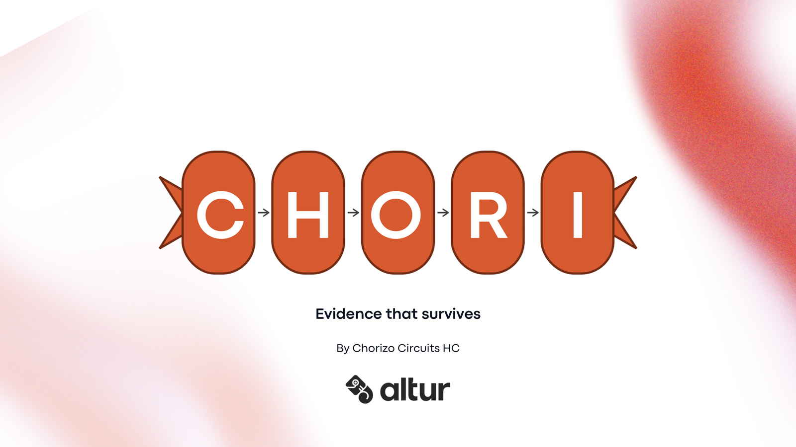
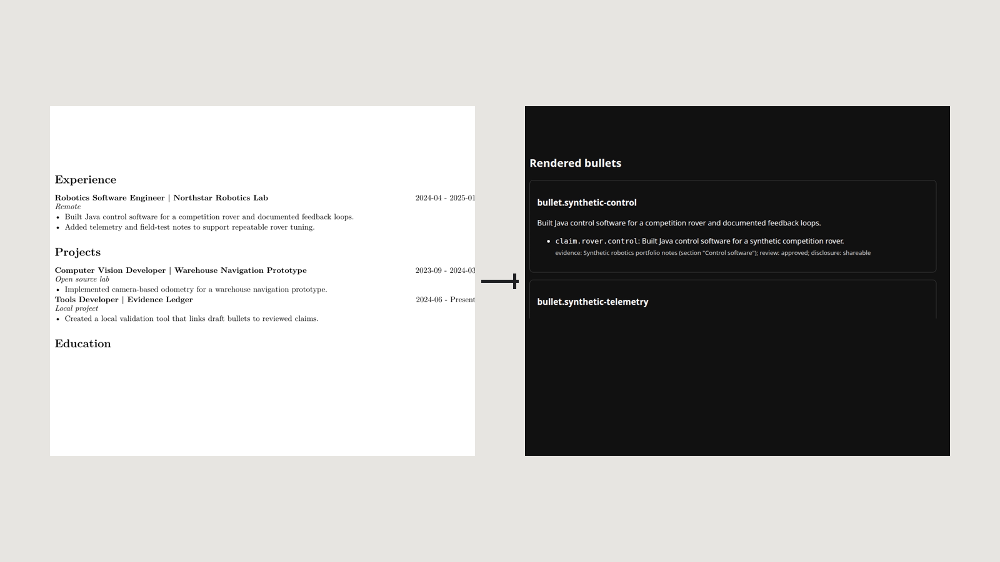
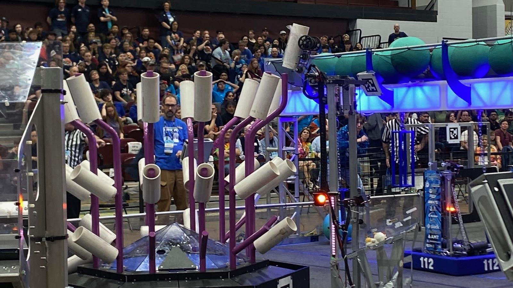
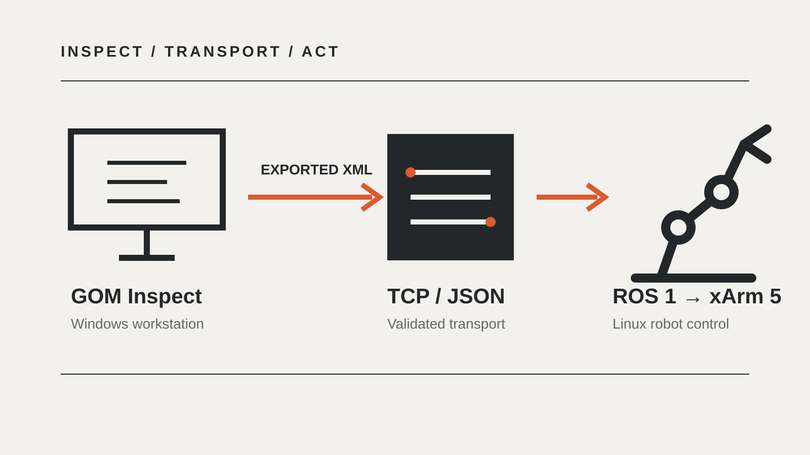
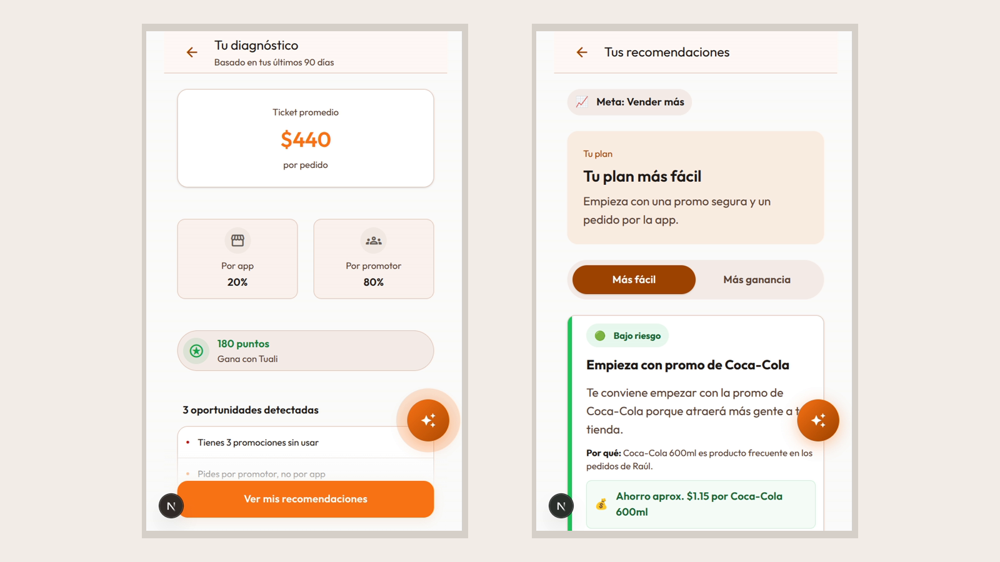

<h1 align="center">Joaquín Rosales</h1>

  <strong>I build systems that have to survive contact with reality.</strong>

  Robotics &nbsp;&middot;&nbsp; Applied AI &nbsp;&middot;&nbsp; Product Engineering

  <a href="https://www.linkedin.com/in/joaquinrog">LinkedIn</a>
  &nbsp;&middot;&nbsp;
  <a href="https://joaq.mx">joaq.mx</a>
  &nbsp;&middot;&nbsp;
  <a href="mailto:joaquinrog06@gmail.com">Email</a>

Today I build and ship production AI agent systems while studying Robotics and Digital Systems Engineering at Tecnológico de Monterrey. My work sits at the intersection of software, robotics, and product engineering.

My engineering path began in FIRST Robotics, where software meets hardware, drivers, match pressure, and hard deadlines. I care less about making a demo look intelligent than about making the underlying system inspectable, measurable, and dependable.

## Selected work

### [Chori: synthetic voice detection](https://github.com/joaquinrog/altur-detect)

**Winner — Altur track, HackMTY 2026.** Real-time synthetic voice detection for 8 kHz telephone calls, built around robustness, calibration, and evidence-driven feature selection.

`Python` `FastAPI` `PyTorch` `Audio ML` `Model calibration`

<table>
  <tr>
    <td width="50%" valign="top">
      
      <h3><a href="https://github.com/joaquinrog/elite-cv">Elite CV Builder</a></h3>
      
A local-first CV system that links every rendered bullet to approved evidence while keeping unsupported or conflicting claims visible.

      
<code>Python</code> <code>JSON Schema</code> <code>LaTeX</code> <code>Provenance</code>

    </td>
    <td width="50%" valign="top">
      
      <h3><a href="https://github.com/HighAltitude9280/RobotCode_2025">FRC 9280 — REEFSCAPE 2025</a></h3>
      
Java/WPILib competition code spanning swerve control, autonomous paths, and multi-camera vision. Built as Lead Programmer during a season that ended at the FIRST Championship.

      
<em>Built before AI coding agents became part of my workflow.</em>

      
<code>Java</code> <code>WPILib</code> <code>PathPlanner</code> <code>PhotonVision</code>

    </td>
  </tr>
  <tr>
    <td width="50%" valign="top">
      
      <h3><a href="https://github.com/joaquinrog/gom-xarm-bridge-mvp">GOM–xArm bridge</a></h3>
      
A ROS 1 bridge carrying exported GOM Inspect measurements from Windows through validated TCP/JSON commands to a Linux-controlled xArm 5.

      
<code>Python</code> <code>ROS 1</code> <code>TCP/IP</code> <code>3D metrology</code>

    </td>
    <td width="50%" valign="top">
      
      <h3><a href="https://github.com/joaquinrog/hack4her-tuAliado">tuAliado</a></h3>
      
A mobile-first growth companion where a deterministic recommendation engine makes decisions and Gemini explains them, with local fallbacks when the model is unavailable.

      
<code>Next.js</code> <code>TypeScript</code> <code>Gemini</code> <code>Web Speech API</code>

    </td>
  </tr>
</table>

## Current work

- **Event Horizon AI:** building and shipping production multi-agent systems with Python, FastAPI, Gemini/Vertex AI, and Google Cloud.
- **Olympus Robotics:** co-founding a multidisciplinary team and leading systems integration toward the University Rover Challenge.
- **[JOAQ](https://joaq.mx):** building products for real operations in Mexico, starting with [Opina](https://joaq.mx/opina), an NFC/QR review flow already operating in local businesses.
- **JoaqOS:** developing a private personal tool that turns financial, health, and training data into concrete daily decisions.

## How I engineer

- **Deterministic core, AI at the right boundary.** Models explain, classify, or assist; they do not silently invent business truth.
- **Evidence before confidence.** I test what a system learned, not only whether it returned the expected answer.
- **Failure is part of the design.** Fallbacks, validation, observability, and explicit unknowns belong in the first architecture pass.
- **The deployment environment matters.** A model, robot, or workflow is only useful when it survives its actual channel, hardware, operator, and cost constraints.

## From robots to products

My FIRST Robotics path spans FLL, FRC, and FTC mentorship. I co-founded High Altitude Robotics 9280, later served as its President, Driver, and Lead Programmer, and was recognized as a **2024 FIRST Dean's List Finalist**.

---

  Monterrey, Mexico &nbsp;&middot;&nbsp; Building in English and Spanish

